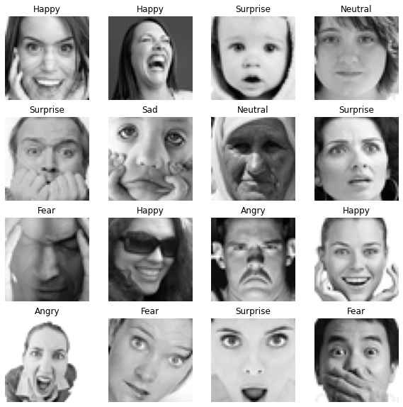

# Facial Expression Recognizer

This is a group project to develop a deep learning neural network that can recognise a range of facial expression 
based on 2D image inputs. The expressions recognised are Happy, Neutral, Sad, Fear, Angry, Surprise, and Disgust.
The neural network chosen is Convolution Neural Network due to its better performance with image data.

The following are the training information and performance results of the neural network... 
  Layers: Please see notebook for breakdown.
  Dataset Size: Training - 28709, Public Test - 3589, and Private Test 3589
  Epochs: 500
  Peak validation accuracy: 64.48%
  Minimum validation loss: 1.0931
